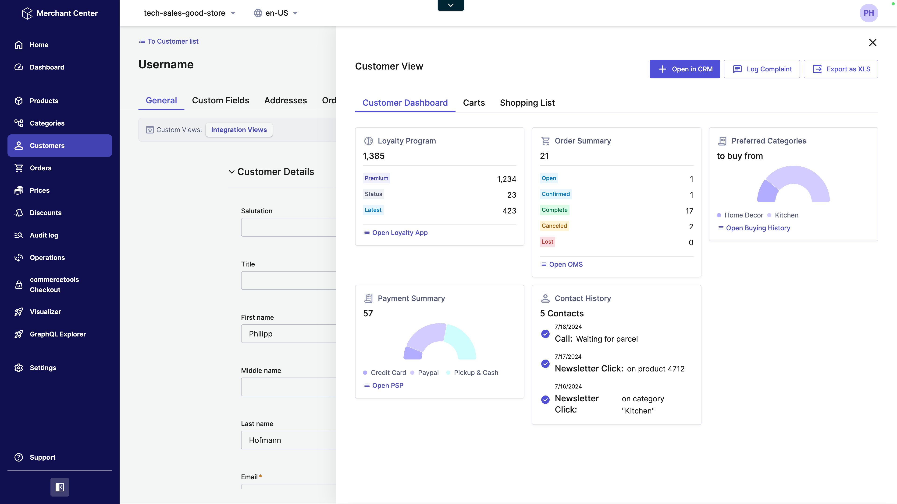
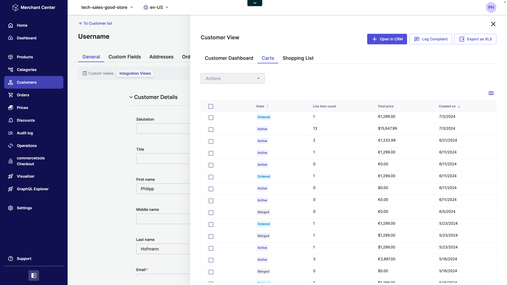
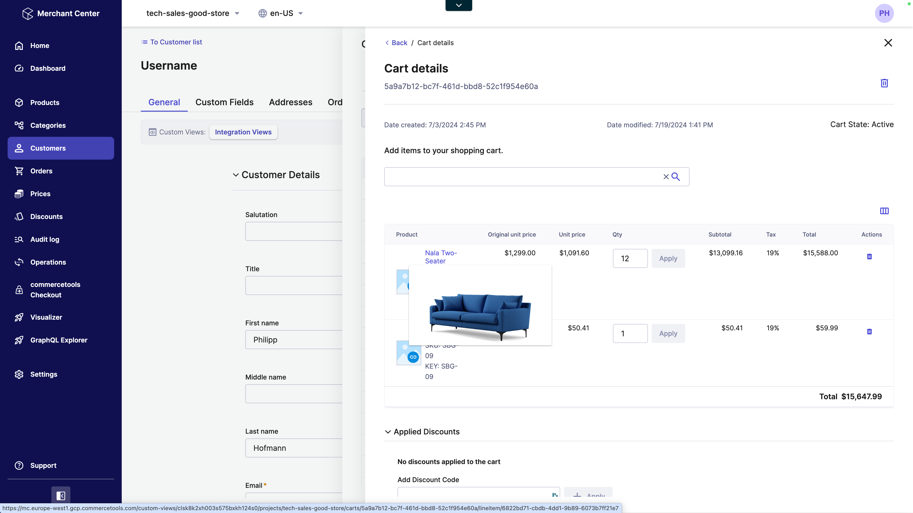
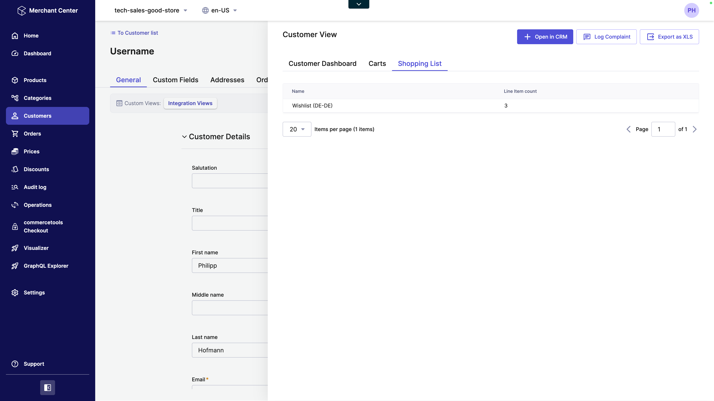
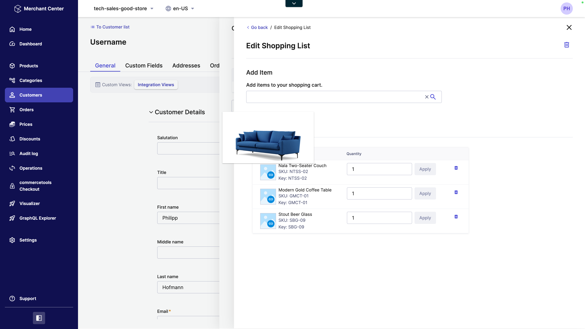
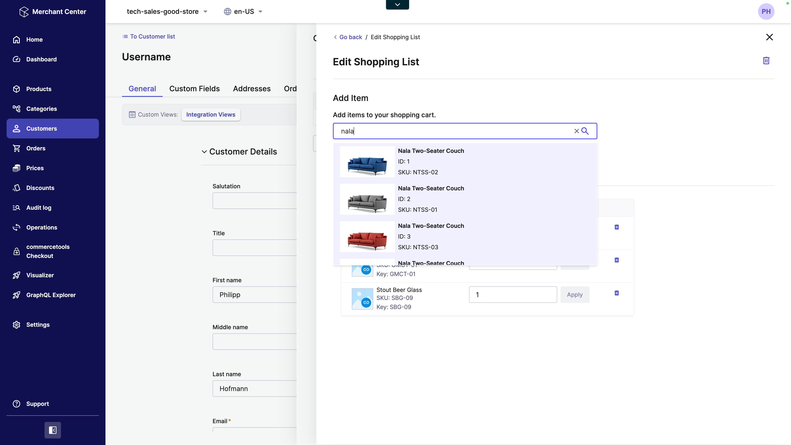
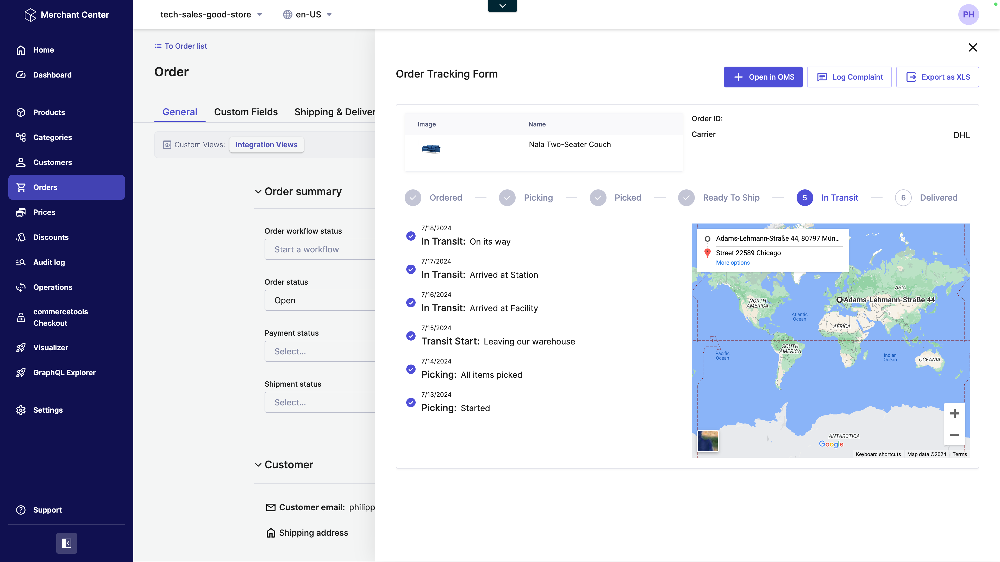

<p align="center">
  <a href="https://commercetools.com/">
    
  </a></br>
  <b>Integration Views</b>
</p>

This is a set of `custom-views` to extend the commercetools Merchant Center with static and dynamic data.

## Current Feature Set

### Custom View for Customers
This custom view is rendering a tabbed container displaying
1. A dashboard of mostly static data to show how external systems could be integrated.
2. The selected customer`s carts with the possibility of updating them.
3. The selected customer`s shopping lists with the possibility of updating them.
### Custom View for Orders
1. A dashboard of mostly static data to show how external systems could be integrated.
 

## Local Development

Update the following section in your [custom-view-config.mjs](./integration-views/custom-view-config.mjs) file
```json    
development: {
    initialProjectKey: 'tech-sales-good-store',
    // hostUriPath: '/tech-sales-good-store/orders/5838b628-38d2-47c1-8576-a1faefa1c21f/general'
    hostUriPath: '/tech-sales-good-store/customers/f52e4230-a1f9-4f49-b6eb-af33fba3ddad/general'
}
```
Set the `initialProjectKey` to your project key.
The `hostUriPath` is your context URL. Read more [here](https://docs.commercetools.com/merchant-center-customizations/api-reference/custom-view-config#envdevelopmenthosturipath)

## Screenshots






